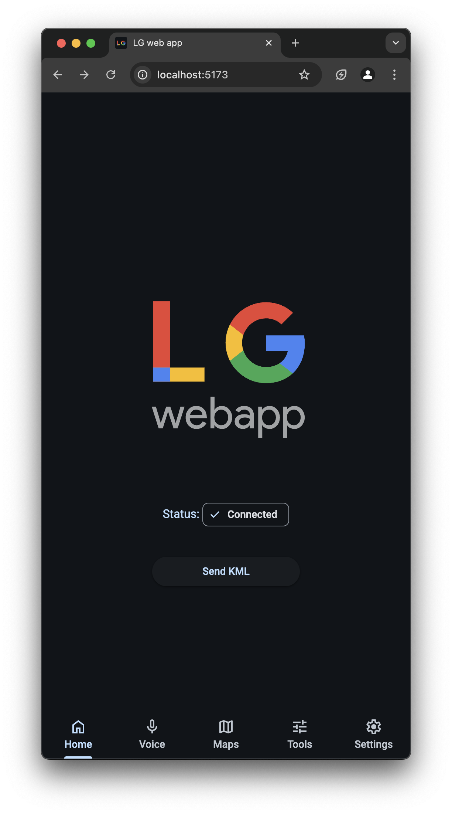
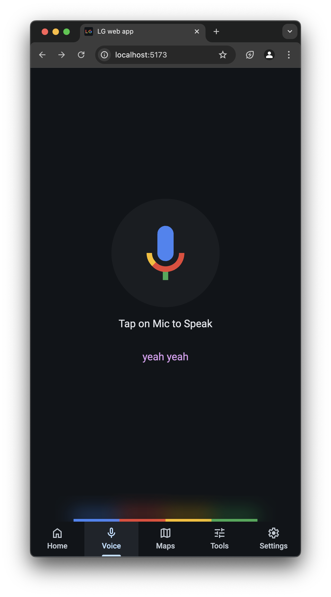
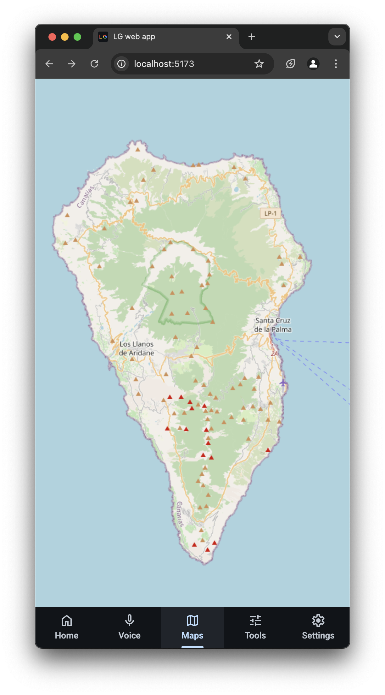
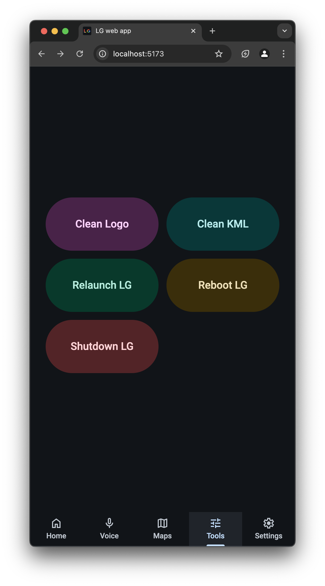
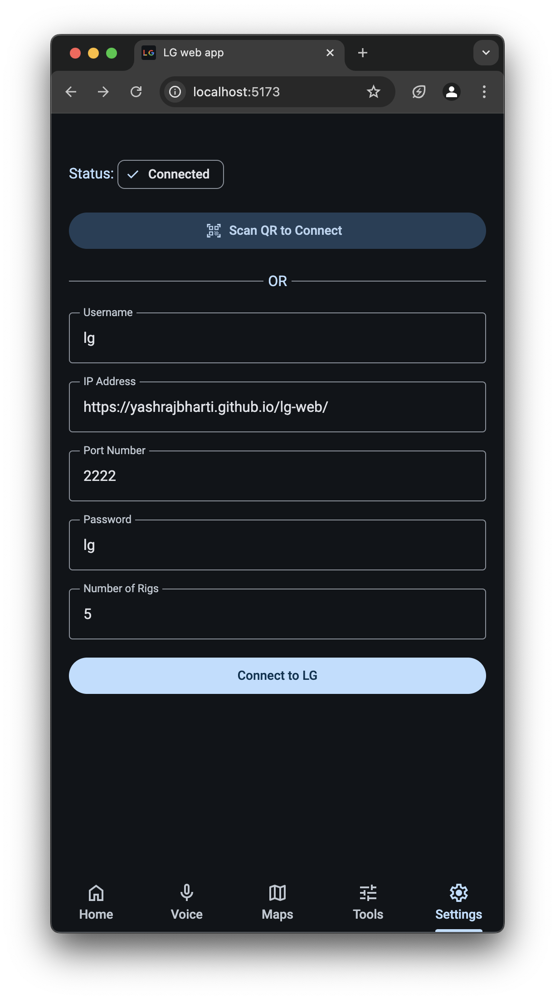

# Liquid Galaxy Web App

An immersive Google Earth web application for Liquid Galaxy, this project is the first web-components-based web app ever created for the Liquid Galaxy project. It offers innovative ways to control Google Earth and send KML data for immersive data visualization.

---

## Features and Pages

### Home Page



- Displays a hero section.
- Includes a "Send KML" button.
- Shows the connection status of your device with Google Earth, similar to the Settings page.

### Voice Page



- Utilizes the Web Speech API for voice control.
- Execute commands like:
  - `Orbit the Earth`
  - `Send KML`
  - `Clean KML`

### Maps Page



- Built using Leaflet.
- Control Google Earth with touch interactions on the map.
- **Innovation Highlight:**
  - Originated from the La Palma Volcano Tracker project.
  - Uses Google Maps for seamless interactivity.

### Tools Page



- Provides utility tools for Liquid Galaxy management, such as:
  - Relaunch
  - Reboot
  - Shut Down
  - Clean KML
  - Clean Logo

### Settings Page



- SSH and connect to Liquid Galaxy (Google Earth cluster).
- Connection Methods:
  - **QR Code Scan:**
    - QR code containing JSON structure:  

      ```json
      {
        "username": "lg",
        "ip": "192.168.29.124",
        "port": "2222",
        "password": "lg",
        "rigs": "5"
      }
      ```

  - **Manual Input:**
    - Enter connection details (username, IP, port, password, rigs).

---

## Why Use the Liquid Galaxy Web App?

This application is the seamless way to control Google Earth:

- Immersive data visualization with KML integration.
- Easy SSH-based cluster connectivity.
- Voice control for hands-free operation.
- Touch interaction with maps for intuitive navigation.
- Simplified tools for device management.

---

## Future Development

- Expand voice commands.
- Introduce more tools for advanced control.
- Enhance accessibility and usability features.

---

> [!TIP]
> As all the pages are in components, this project can be used as a template for future liquid galaxy projects.

---

## License

This project is licensed under the [MIT License](LICENSE).

---

Feel free to contribute or raise issues in the repository for continuous improvements.
